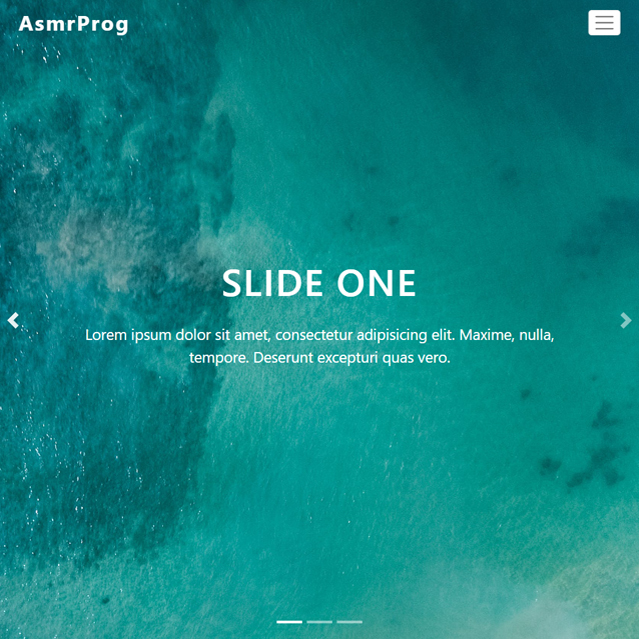

# Bootstrap Slider
In this tutorial ([Open in Youtube](https://youtu.be/MoN8OYHwe1M)), I'm going to show you how to use modern HTML and CSS and bootstrap to create a completely responsive carousel with awesome bootstrap navbar. We'll be using bootstrap framework for our responsive design and CSS  transition for some cool color animation effects. Also we have a great navbar for it! This project contains Bootstrap Navbar and Carousel!

# Screenshot
Here we have project screenshot :

# AsmrProg

We create a project each 4 days with voting on our <a href="https://youtube.com/@AsmrProg" target="_blank">Youtube</a> channel.
You can vote for upcoming projects on our channel **community** page :wink: